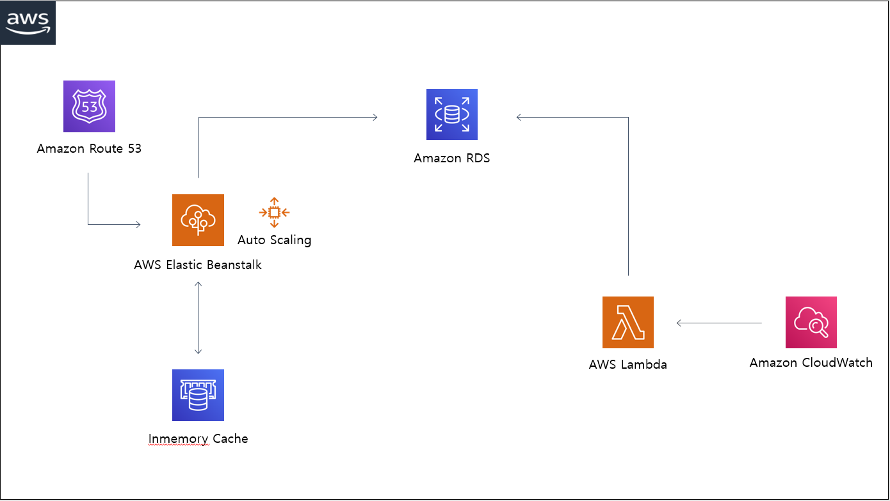

# deliSHAs.v2.backend

서울대학교 학식 어플리케이션 백엔드 프로젝트로, 크롤러, 캐시 등을 이용한 효율적인 서버를 구축하였습니다.

## Features
* Using C# .net core
* Based on Clean Architecture
* Using Inemory Cache for Low Transaction
* Dockerize Application with EB
* Build CI / CD Pipeline with Jenkins

***

## Focus

- Low Latency
- Low Transaction
- Efficient Resouce Management
  
***

## Architecture

### WAS

WAS 는 클라이언트의 요청을 받아, 캐시에 해당 날짜 데이터가 있다면 바로 반환, 없다면 DB 를 통해 데이터를 가져오고, 캐시에 저장 후, 반환하는 역할을 담당하고 있습니다.

***

### Crawler
[deliSHAs crawler](https://github.com/BaekGeunYoung/deliSHAs_crawler)

***

## API Protocol

### GetRestaurants
- Method : GET
- Endpoint : DelishasWas-env.eba-xpez2dip.ap-northeast-2.elasticbeanstalk.com/api/v2/restaurants 
- ETC : http 만 지원, 추후에 ssl + route 53 붙일 예정 (클라 배포 일정과 맞춰서)
